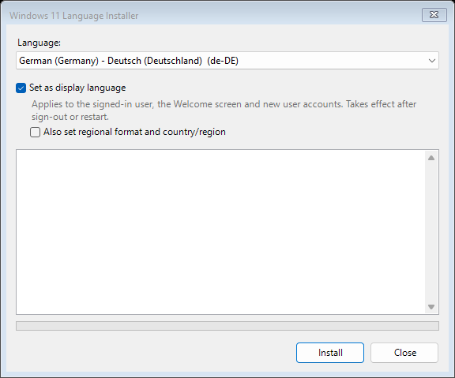

# LanguagePackInstaller

Windows 11 Language Installer for SCCM. It installs a language from your own language
repository (CABs from the Languages and Optional Features ISO) and can make it the display
language. It has a Windows Forms GUI, and a silent mode for fixed-language deployments.

Supports **Windows 11 24H2 (build 26100) and later**, client editions only. The scripts are meant to run as **SYSTEM**
from a ConfigMgr application deployment; they do not check for administrator rights, so start them elevated when
you run them by hand (otherwise DISM fails with "Access is denied").



The language list shows each language's English and native name and its tag, marks partial languages
`[partial]` and languages already on the device `[installed]`. The log box shows each step while it runs.

For an installed language the window offers **Uninstall this language**. Ticking it asks first: a restart is
required, and if the language is the display language it is set back to the default (the language Windows was
installed with) before it is removed. The button then reads **Uninstall**. The language Windows was installed with
is shown greyed out: it cannot be removed.

The window is built for large, high-resolution screens: it is DPI-aware (sharp text at 125-200 % scaling instead
of a stretched bitmap), uses Segoe UI 11 pt (Consolas 10.5 pt in the log), and has fixed high-contrast colours
that do not depend on the user's theme (it may run as SYSTEM in the user's session).

| File | Purpose |
|---|---|
| `Install-LanguagePack.ps1` | Entry point. GUI (language drop-down, "Set as display language") or `-Silent`. |
| `Uninstall-LanguagePack.ps1` | Removes a language installed with this tool (the uninstall program for ConfigMgr). |
| `LanguagePackInstaller.psm1` | Core logic: repository discovery, DISM install, system settings, per-user hand-off. |
| `Set-UserLanguage.ps1` | Per-user (HKCU) settings. Runs as each user, never on behalf of one. |
| `Complete-SystemLanguage.ps1` | One-shot SYSTEM startup task that finishes the system display language after the restart, if Windows refused it during the install. |
| `New-LanguageRepository.ps1` | Builds a trimmed repository for chosen languages from the LOF ISO. |
| `languagecabs.csv` | Listing of the 24H2 LOF ISO `LanguagesAndOptionalFeatures` folder, for reference. |

## Why DISM and not `Install-Language`

`Install-Language` (LanguagePackManagement) has no source parameter: it always downloads from
Windows Update or the Store, which fails on WSUS- or ConfigMgr-managed devices. This installer
adds the CABs with DISM (`Add-WindowsPackage` / `Add-WindowsCapability -Source -LimitAccess`)
and uses LanguagePackManagement for the system settings afterwards (`Set-SystemPreferredUILanguage`).

## System-wide vs per-user settings

| Setting | Cmdlet | Scope | Stored in | Needs |
|---|---|---|---|---|
| Language pack, language features, fonts | `Add-WindowsPackage`, `Add-WindowsCapability` | **System** | Component store | Admin/SYSTEM, sometimes restart |
| Translated resources for installed FODs (Notepad, Paint, RSAT...) | `Add-WindowsPackage` | **System** | Component store | Admin/SYSTEM |
| System preferred UI language | `Set-SystemPreferredUILanguage` | **System** | HKLM | Admin, restart |
| Welcome screen and new-user defaults | `Copy-UserInternationalSettingsToSystem` | **System**, copied *from the running account* | HKLM, Default user hive | Admin |
| System locale (non-Unicode programs) | `Set-WinSystemLocale` | **System** | HKLM | Admin, restart |
| Keep unused language packs | `BlockCleanupOfUnusedPreinstalledLangPacks` policy | **System** | HKLM | Admin |
| Display language for a user | `Set-WinUILanguageOverride` | **User** | `HKCU\Control Panel\Desktop` | Sign-out |
| Language list and keyboards | `Set-WinUserLanguageList` | **User** | `HKCU\Control Panel\International\User Profile`, `HKCU\Keyboard Layout` | |
| Regional format | `Set-Culture` | **User** | `HKCU\Control Panel\International` | |
| Country or region | `Set-WinHomeLocation` | **User** | `HKCU\Control Panel\International\Geo` | |

The per-user cmdlets have no `-User` parameter. Run as SYSTEM, they change SYSTEM's own
settings and the actual user sees nothing. So the installer:

1. Applies the user settings to the **running account** (SYSTEM under ConfigMgr), then runs
   `Copy-UserInternationalSettingsToSystem`, so the **Welcome screen and new users** get them.
2. Runs `Set-UserLanguage.ps1` as **each signed-in user** through a one-shot scheduled task
   (`LogonType Interactive`, no password needed when SYSTEM registers it).
3. With `-ApplyToExistingUsers`, registers **Active Setup** so every other existing profile
   gets the settings once at its next sign-in.

PSAppDeployToolkit is not required. See [Using PSAppDeployToolkit 4.x](#using-psappdeploytoolkit-4x)
if you want to wrap it anyway.

## What a run does

1. Checks the prerequisites: 64-bit, build 26100 or later, client OS, LanguagePackManagement
   available, repository has language packs and `metadata`.
2. Adds the language pack CAB (skipped if already installed).
3. Adds the language features in order: Basic, script font (ja/ko/zh/ar/he/th), OCR,
   Handwriting, TextToSpeech, Speech. It uses `Add-WindowsCapability` and falls back to the CAB
   if that fails. Only a Basic failure stops the run.
4. Adds this language's satellite CABs for Features on Demand that are already installed.
5. Sets `BlockCleanupOfUnusedPreinstalledLangPacks`, so Windows' `LPRemove` task does not remove
   a language no one has selected yet (skip with `-AllowLanguageCleanup`). If the policy was not set already,
   it records that in `HKLM\SOFTWARE\LanguagePackInstaller` (`CleanupPolicySet`), so the uninstall removes only
   a policy this tool set, never one set by Group Policy.
6. If **Set as display language** is ticked: runs the system and per-user steps above.
   Optionally sets the regional format and country/region as well. Straight after the language
   pack is added, Windows can refuse the system steps ("Value does not fall within the expected
   range") until the restart that completes it. In that case the installer logs a warning, still
   applies the per-user settings, and registers the startup task
   `LanguagePackInstaller-CompleteSystemLanguage`. That task finishes the system part after the
   restart and then removes itself; a second restart then shows the new language on the
   Welcome screen.
7. Writes `HKLM\SOFTWARE\LanguagePackInstaller\Languages\<tag>` (`InstalledOn`, `Source`) and, for
   the display language, `HKLM\SOFTWARE\LanguagePackInstaller\DisplayLanguage`.

## Building the repository

```powershell
# What is on the ISO?
.\New-LanguageRepository.ps1 -Source F:\LanguagesAndOptionalFeatures -ListAvailable

# Build or extend a repository (run again later to add languages)
.\New-LanguageRepository.ps1 -Source F:\LanguagesAndOptionalFeatures -Destination \\server\LangRepo -Language de-DE, fr-FR, ja-JP
```

From `powershell.exe -File` (cmd, a batch file, a scheduled task), pass the languages as one comma-separated value,
for example `-Language de-DE,fr-FR,ja-JP`; commas, semicolons and spaces all separate tags, in any letter case.

It copies the `metadata` folder, plus each language's language pack, features, font and FOD
satellites (`-SkipFodSatellites` leaves the satellites out). Keep the repository out of Git
(`.gitignore` already excludes `Repository/` and `*.cab`).

The LOF media must match the OS build: 26100 media covers 24H2 and 25H2 (25H2 is an enablement
package on 26100). After you add languages, the next cumulative update brings their resources
up to date, so add languages before patching where you can.

Partial languages (ca-ES, eu-ES, gl-ES, id-ID, vi-VN) need a base language installed first. The
installer warns if none of the usual base languages is present.

## Running it

```powershell
# GUI. The repository defaults to .\Repository
.\Install-LanguagePack.ps1 -Repository \\server\LangRepo

# Silent, fixed language
powershell.exe -NoProfile -ExecutionPolicy Bypass -File .\Install-LanguagePack.ps1 `
    -Repository \\server\LangRepo -Language de-DE -SetDisplayLanguage -Silent
```

| Parameter | Effect |
|---|---|
| `-Repository` | Repository folder or UNC path. Default: `Repository` next to the script. |
| `-Language` | Language tag. Required with `-Silent`; preselects it in the GUI. |
| `-SetDisplayLanguage` | System default + Welcome screen + new users + signed-in user(s). |
| `-SetRegionalFormat` | With `-SetDisplayLanguage`: regional format and country/region as well. |
| `-SetSystemLocale` | Language for non-Unicode programs (restart). |
| `-ApplyToExistingUsers` | With `-SetDisplayLanguage`: every other existing profile at its next sign-in (Active Setup). |
| `-AllowLanguageCleanup` | Don't set the policy that keeps unused language packs. |
| `-Silent` | No GUI. |
| `-LogPath` | Log folder. Default: `%windir%\Logs\LanguagePackInstaller`. |

**Exit codes:** `0` success, `3010` success with a restart needed (any display-language change
returns this), `1602` GUI closed without installing, `1603` failure.

**Logs** (CMTrace format):
- `%windir%\Logs\LanguagePackInstaller\LanguagePackInstaller.log`: main log.
- `%windir%\Logs\LanguagePackInstaller\LanguagePackInstaller-DISM.log`: DISM detail.
- `%ProgramData%\LanguagePackInstaller\Logs\User-<username>.log`: per-user steps.

## Uninstalling

```powershell
powershell.exe -NoProfile -ExecutionPolicy Bypass -File .\Uninstall-LanguagePack.ps1 -Language de-DE
```

It removes, in this order: the language features that depend on Basic (OCR, Handwriting, TextToSpeech, Speech);
the language pack, which takes its own localised parts (Notepad, Media Player, ...) with it; any satellite package
of the language that is still installed; then Basic and the script font, which Windows treats as permanent while the
language pack is installed. Then it checks that nothing of the language is left, and removes
`HKLM\SOFTWARE\LanguagePackInstaller\Languages\<tag>`.

- **Not removed completely (1603):** if anything of the language is still installed at the end, it is named in the log,
  and the registry entry is kept, so a deployment still sees the language as installed. Restart and run it again.

- **Refused (1603):** the language Windows was installed with, and a display language (the system's, or the one this
  tool set) unless `-ResetDisplayLanguage` is given. Nothing is removed.
- **`-ResetDisplayLanguage`** (the GUI always uses it): a display language is first set back to the language Windows
  was installed with - the system, the Welcome screen and new users, the signed-in users and, if Active Setup was used,
  every other user at their next sign-in - and taken out of those users' language lists; then it is removed. If
  Windows will not remove its language pack before the restart, the startup task
  `LanguagePackInstaller-CompleteUninstall-<tag>` finishes the uninstall after the restart and then removes itself
  (exit `3010`; the registry entry stays until it is done).
- **Script fonts** (Japanese, Korean, Chinese, Arabic, Hebrew, Thai) are kept while another installed language uses them.
- **`BlockCleanupOfUnusedPreinstalledLangPacks`** is removed only when this tool set it and no language it installed
  is left. `-KeepCleanupPolicy` keeps it.
- An Active Setup entry that would apply the language to users again is removed.
- **Not installed** is a success (`0`), so the uninstall can run again.
- **Per-user language lists** are changed only by `-ResetDisplayLanguage` (as above); otherwise a user who added the
  language keeps the entry until they remove it in Settings > Time & language.

Exit codes: `0` success, `3010` restart needed (removing a language pack usually needs one), `1603` failure or
refused. It logs to the same `LanguagePackInstaller.log`.

## Deploying with ConfigMgr

Create an **Application** with a Script Installer deployment type:

- **Program:** `powershell.exe -NoProfile -ExecutionPolicy Bypass -File Install-LanguagePack.ps1 -Repository \\server\LangRepo`
  (add `-Language xx-XX -SetDisplayLanguage -Silent` for a fixed-language app).
- **Installation behavior:** Install for system.
- **GUI version only:** Logon requirement "Only when a user is logged on" and tick **"Allow users
  to view and interact with the program installation"**. Otherwise the form, which runs as
  SYSTEM, is invisible.
- **Uninstall program:** `powershell.exe -NoProfile -ExecutionPolicy Bypass -File Uninstall-LanguagePack.ps1 -Language xx-XX`
  (fixed-language apps).
- **Return codes:** keep the defaults: 3010 is a soft reboot and 1602 is a cancel.
- **Detection method:** registry key `HKLM\SOFTWARE\LanguagePackInstaller\Languages\<tag>` exists
  (fixed-language app), or `HKLM\SOFTWARE\LanguagePackInstaller\DisplayLanguage` equals `<tag>`.
  For the GUI version, which can install any language, any value you want to re-run on works.
- **Repository on a share:** SYSTEM reaches it as the computer account, so give **Domain
  Computers** read access to the share and NTFS. Alternatively, put the repository in the
  package content as `Repository\`. That's simpler but larger (a language with its features and
  satellites is typically 100-300 MB).

## Using PSAppDeployToolkit 4.x

Not needed, but if you standardise on it, call the script from the `Install` section of
`Invoke-AppDeployToolkit.ps1` and map its exit code:

```powershell
$result = Start-ADTProcess -FilePath "$env:windir\System32\WindowsPowerShell\v1.0\powershell.exe" `
    -ArgumentList "-NoProfile -ExecutionPolicy Bypass -File `"$($adtSession.DirFiles)\Install-LanguagePack.ps1`" -Repository \\server\LangRepo -Language de-DE -SetDisplayLanguage -Silent" `
    -SuccessExitCodes 0 -RebootExitCodes 3010 -PassThru
```

PSADT's own dialogs show in the user session without the ConfigMgr "allow interaction" option,
but this script's WinForms GUI does not. Use `-Silent` under PSADT, or pick the language with
PSADT prompts. `Start-ADTProcessAsUser` is a drop-in alternative to the scheduled-task user step.

## Status

The repository discovery, CAB matching and FOD-satellite selection have been tested against the
24H2 LOF listing in `languagecabs.csv`, and on 2026-10-03 against the real `LanguagesAndOptionalFeatures` folder on a
Windows 11 25H2 PC: all 43 languages (38 full, 5 partial) resolve to their language pack, Basic feature and script
font, each with 82 FOD satellites, and `New-LanguageRepository.ps1` builds a working repository. The uninstall logic
is tested with DISM mocked (20 checks, Windows PowerShell 5.1 and 7).

On 2026-10-04 a real install and uninstall of de-DE on that Windows 11 25H2 PC: the GUI opened and closed (1602);
`-Silent` installed the language pack and its five features in about 3.5 minutes (exit 0). The first version of the
uninstall removed the language pack but left `Language.Basic` installed (permanent while the language pack was
installed) and reported success; that led to the removal order and the final check above.

On 2026-10-04 on a Windows 11 VM, from the GUI: fr-FR installed as the display language (3010; Windows refused the
system preferred UI language during the install, as expected, and the startup task set it after the restart and
removed itself). Then, from the same window, fr-FR was uninstalled with the display language set back to en-US, and
de-DE uninstalled after it: all features, the language pack and Basic removed in order, no DISM errors, 3010 each
(DISM asked for a restart).

Still to test: a run as SYSTEM from ConfigMgr, other signed-in users and Active Setup for other profiles.
